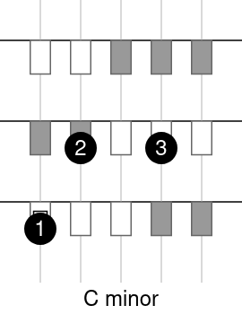
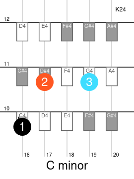
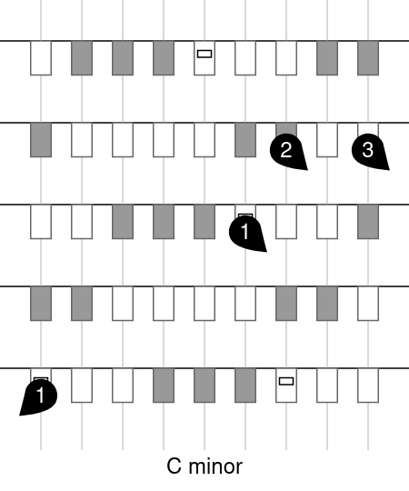

# HarpejjiTabs

This is an online tablature editor for the [harpejji](https://www.marcodi.com/), based on [vuejs](https://vuejs.org/).

Try it [there](https://amiguet.github.io/harpejjitabs/)!

## Features

- make tablatures with finger numbers and title:

    

- Add colors, include fret and string numbers, note names and harpejji model:

    

- Left hand/Right hand notation:

    

- Save/load files, export to svg/png.

- Play notes when clicked, play or arpeggiate chord.

- Implemented as a PWA: install it on your phone like a native app, use it offline!

## Credits

This project has been developed by Nicolas Laoun as part of his curriculum in the technical university [HE-Arc ingénierie](https://www.he-arc.ch/ingenierie) on an original idea and in collaboration with [Matthieu Amiguet](http://www.matthieuamiguet.ch/) from [Les Chemins de Traverse](https://www.lescheminsdetraverse.net/). The work has been directed by [David Grunenwald](https://people.he-arc.ch/contact.php?id=2840235).